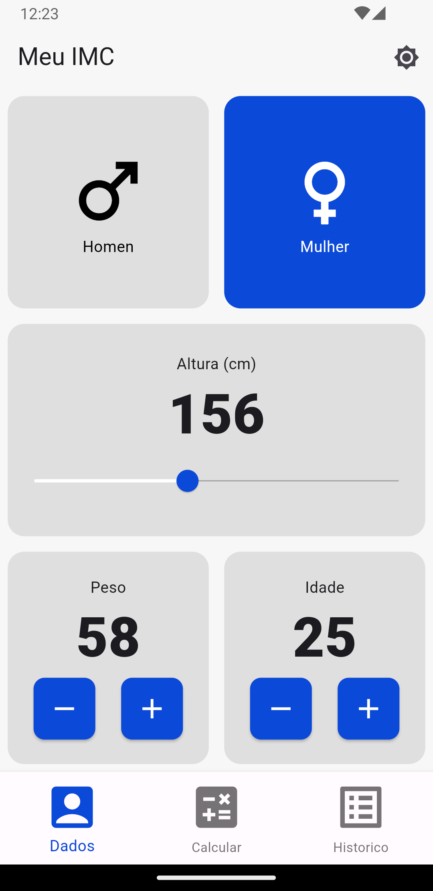
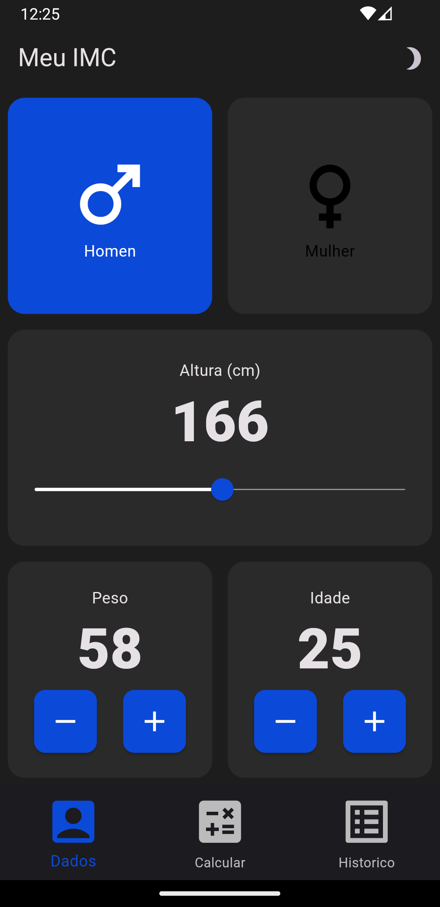
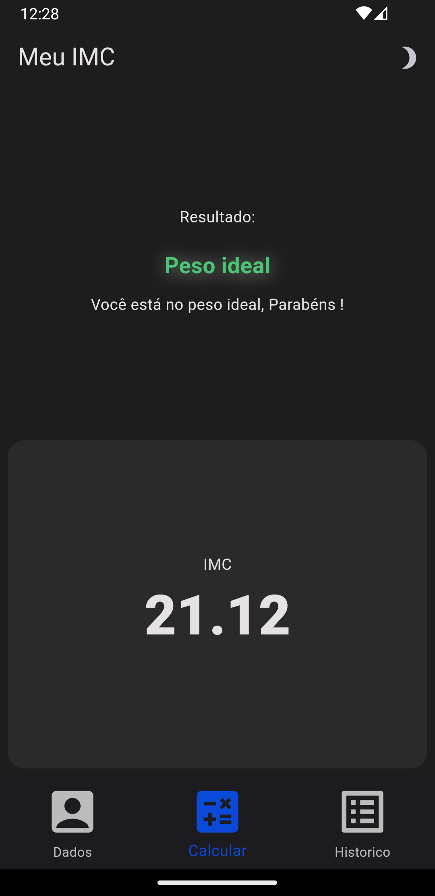
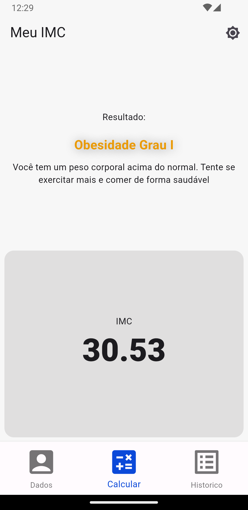
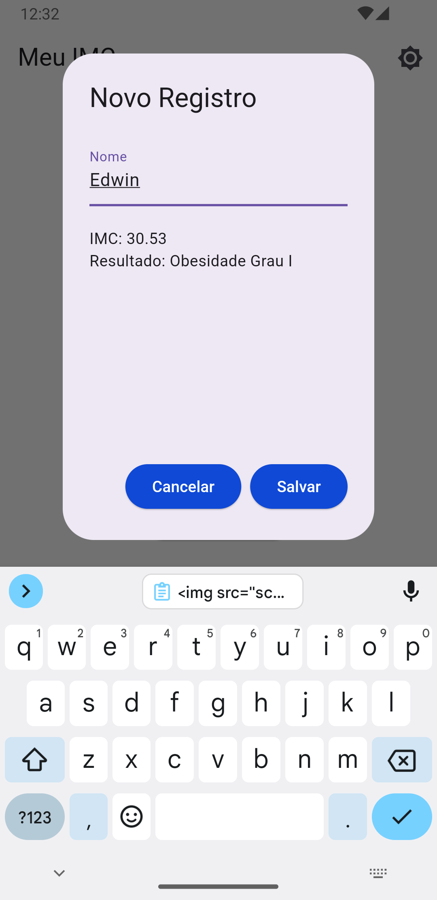

# Meu IMC
Este é um App para Android / IOS projeto desenvolvido em Flutter, que tem como objetivo cumprir com desafio do curso Flutter Specialist da Dio.me e o Bootcamp Flutter da appbrewery.com

### Screenshots
<p float="left">
  
   
   
   
   
   
</p>

### Funcionalidades
Este aplicativo tem as seguintes funcionalidades:

1. Cálculo do Índice de Massa Corporal (IMC).
2. Exibição do resultado do IMC com interpretação (abaixo do peso, normal, sobrepeso, etc.).
3. Armazenamento do histórico de cálculos de IMC.
4. Possibilidade de excluir cálculos de IMC do histórico.
5. Interface amigável e fácil de usar.

### Começando
Estas instruções fornecerão uma cópia do projeto em funcionamento na sua máquina local para fins de desenvolvimento e teste.

### Pré-requisitos
O que você precisa para instalar o software e como instalá-lo:

- Flutter SDK - 3.16 
- Dart 3.2.6
- Um editor de código como VS Code ou Android Studio

### Instalação
1. Clone o repositório
```
git clone https://github.com/edwinbustillos/app-meu-imc-flutter.git
```

2. Entre no diretório do projeto
```
cd meu_imc
```

3. Instale as dependências
```
flutter pub get
```

4. Inicie o app
```
flutter run
```

### Contribuindo
Contribuições e sugeestões são sempre bem-vindas! 